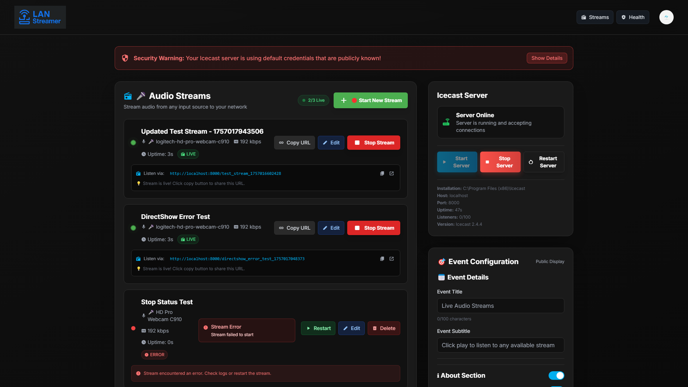
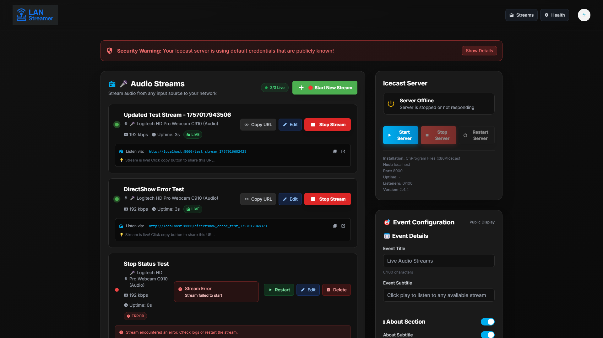
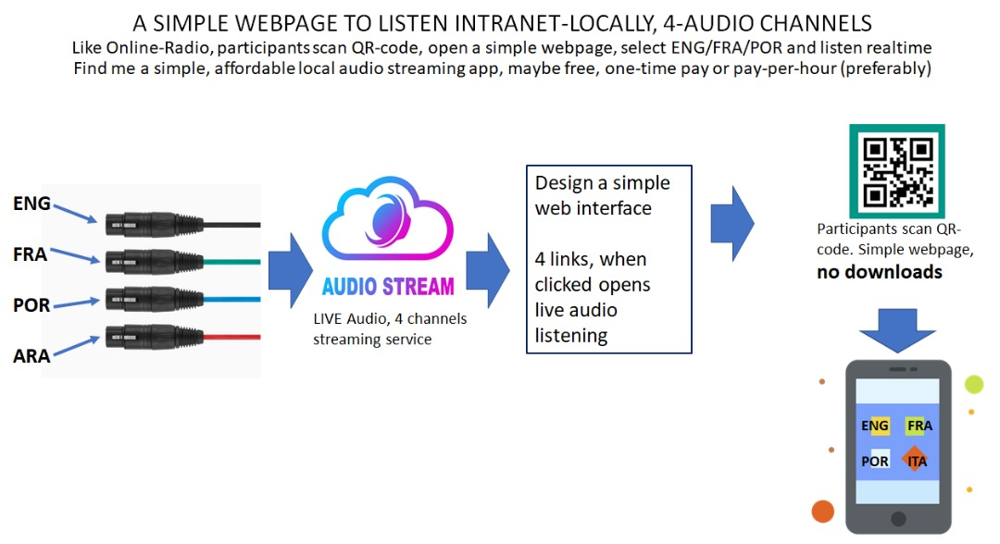
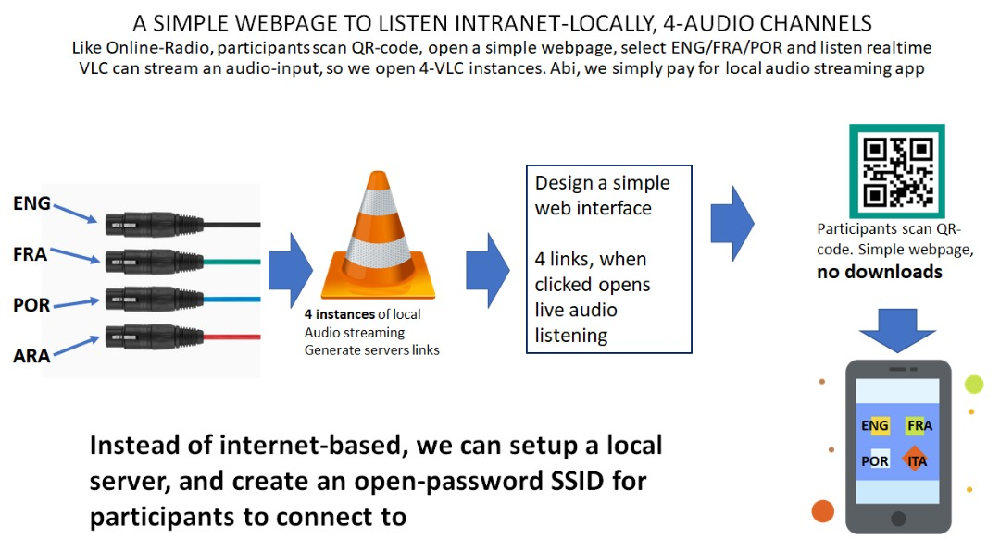

# LANStreamer

A comprehensive solution that turns a standard PC into a multi-channel audio streaming server for local area networks (LAN). This project provides a **web-based application** that orchestrates **FFmpeg** and **Icecast** to deliver local, live, low-latency audio broadcasts for events like language interpretation, meetings, or conferences.

## 📋 Table of Contents

- [Security Notice](#️-security-notice---important)
- [Quick Start (Non-Technical Users)](#-quick-start-non-technical-users)
- [What is LANStreamer?](#-what-is-lanstreamer)
- [Key Features](#-key-features)
- [Use Cases](#-use-cases)
- [Project Structure](#-project-structure)
- [System Requirements](#-system-requirements)
- [Installation](#-installation)
  - [Quick Installation Guide](#quick-installation-guide)
  - [Audio Device Configuration](#audio-device-configuration)
  - [Advanced Setup Options](#-advanced-setup-options)
- [Manual Installation](#-manual-installation)
- [Usage](#-usage)
- [Configuration](#configuration)
- [API Documentation](#-api-documentation)
- [Troubleshooting](#-troubleshooting)
- [Contributing](#-contributing)
- [License](#-license)
- [Support](#-support)

## ⚠️ **SECURITY NOTICE - IMPORTANT!**

**🔐 CHANGE YOUR ADMIN LOGIN DETAILS IMMEDIATELY AFTER INSTALLATION!**

LANStreamer comes with **default admin credentials** for easy setup, but you **MUST change these** to protect your installation:

- **Default Username**: `admin`
- **Default Password**: `lanstreamer123`

**To change these:**
1. Copy `env.example` to `.env` (if not already done)
2. Edit the `.env` file and change:
   - `ADMIN_USERNAME=your-new-username`
   - `ADMIN_PASSWORD=your-strong-password`
3. Restart LANStreamer

**Why this matters:**
- Anyone on your network can access the admin dashboard with default credentials
- The admin dashboard controls all streaming functions
- Default credentials are publicly known

> **💡 Pro Tip**: Use a strong password with numbers, symbols, and mixed case letters!

## 🚀 Quick Start (Non-Technical Users)

**The easiest way to get started - no command line needed!**

### Step 1: Install Prerequisites (One-time setup)
**You need these two programs installed first:**
- **Node.js**: Download from https://nodejs.org/ (choose "LTS" version)
- **FFmpeg & Icecast**: See our [Installation Guides](docs/guides/README.md) for step-by-step instructions

> **💡 Tip**: The installation guides are written for non-technical users with screenshots and simple steps.

### Step 2: Download & Extract LANStreamer
1. **Download**: Go to https://github.com/jerryagenyi/LANStreamer
2. **Get ZIP**: Click the green **"Code"** button → **"Download ZIP"**
3. **Extract**: Right-click the ZIP file → **"Extract All"** or **"Extract Here"**
4. **Open Folder**: Navigate to the extracted `LANStreamer` folder

### Step 3: One-Click Start
1. **Double-click**: `Start LANStreamer Server.bat`
2. **Wait**: The system will automatically install dependencies and start
3. **Note the URLs**: The terminal will show your network addresses

### Step 4: Access Your Streaming Server
- **Admin Dashboard**: Visit `http://YOUR-IP:3001` (login required - see credentials below)
- **Listener Page**: Visit `http://YOUR-IP:3001/streams` (public access for your audience)

**Example URLs:**
- Admin: `http://192.168.1.100:3001`
- Listeners: `http://192.168.1.100:3001/streams`

**Default Admin Credentials:**
- **Username**: `admin`
- **Password**: `lanstreamer123`
- **⚠️ CRITICAL**: Change these immediately in your `.env` file for security!

> **💡 That's it!** Your streaming server is now running. Share the listener URL with your audience.

---

## 🚀 Quick Start (Technical Users)

**For developers and command-line users:**

```bash
# Clone the repository
git clone https://github.com/jerryagenyi/LANStreamer.git
cd LANStreamer

# Install dependencies
npm install

# Start the server
npm start
```

Then visit `http://localhost:3001` for the admin dashboard.

---

## 🔄 Updating LANStreamer

**For ZIP Download Users (Recommended):**

LANStreamer includes automatic update scripts that preserve your settings:

### **Option 1: Full Update (Recommended)**
1. **Double-click** `Update LANStreamer.bat` in your installation folder
2. **Follow the prompts** - the script will:
   - ✅ Backup your configuration and data
   - ✅ Download the latest version
   - ✅ Install updates while preserving your settings
   - ✅ Show detailed progress

### **Option 2: Quick Update**
1. **Double-click** `Quick Update LANStreamer.bat` for a faster update
2. **Less verbose** but preserves your critical settings

### **Option 3: Manual Update**
1. **Backup** your `.env`, `icecast.xml`, `data/`, and `logs/` folders
2. **Download** the latest release from [GitHub Releases](https://github.com/jerryagenyi/LANStreamer/releases/latest)
3. **Extract** the new files over your installation
4. **Restore** your backed up files

**For Git Users:**
```bash
git pull origin main
npm install  # If dependencies changed
```

> **💡 Pro Tip:** The web dashboard will notify you when updates are available!

---

## Why I Built This

I built the app for audio streaming (simultaneous multiple sources) on Local Area Network. The easiest example (actually why I built it) is for translation services during conferences.

For example:
- Event organisers share access to a particular Wi-Fi with you the attendee
- Next they share a URL with you to listen
- You visit the URL (no internet needed, just access that Wi-Fi)
- You see multiple streams on the page in different languages
- You click to play the one you want


## Project Structure

```
LANStreamer/
├── Start LANStreamer Server.bat            # Windows startup batch file
├── Create-Desktop-Shortcut.ps1             # Desktop shortcut creator
├── README.md                               # This file - project overview
├── package.json                            # Node.js dependencies and scripts
├── src/                                    # Backend Node.js application
│   ├── server.js                           # Main server entry point
│   ├── routes/                             # API route handlers
│   └── services/                           # Core business logic
├── public/                                 # Frontend web interface
│   ├── index.html                          # Admin dashboard
│   ├── streams.html                        # User streams page
│   └── components/                         # Modular UI components
├── config/                                 # Configuration files
├── logs/                                   # Application logs
├── docs/                                   # Documentation and guides
│   └── guides/                             # Installation and troubleshooting guides
└── manual-setup/                           # Advanced manual setup guides
```

## Features

- **Audio Device Detection:** Automatically detects and lists available input audio devices (microphones, audio interfaces, virtual audio cables).
- **Multi-Stream Management:** Create, start, and stop individual audio streams from a web-based dashboard.
- **Real-time Status:** View live status of all streams and system components.
- **Network Broadcasting:** Stream audio to any device on your local network via web browsers.
- **Professional Audio Support:** Works with professional audio interfaces, virtual audio routing, and multi-channel setups.
- **Easy Startup:** One-click Windows batch file for quick server startup with optional Icecast integration.

## How It Works

LANStreamer creates a complete audio streaming ecosystem with two main interfaces and three core components:

### 🎛️ **Admin Dashboard** (`http://localhost:3001/`)
The control center where administrators:
- **Manage Streams:** Create, Start, and Stop audio streams
- **Monitor System:** Check FFmpeg and Icecast status in real-time
- **Configure Settings:** Set up event details and contact information for support
- **View Analytics:** Monitor active streams and system performance

### 🎧 **Listener Interface** (`http://localhost:3001/streams`)
The user-friendly page where listeners:
- **Browse Streams:** See all available audio streams
- **Listen Live:** Click to play any stream instantly
- **Mobile Friendly:** Works on phones, tablets, and computers
- **No Apps Required:** Just open in any web browser

### ⚙️ **Core Components**
1.  **Audio Input:** Any detected audio device (microphone, audio interface, virtual audio cable) provides audio to the host PC.
2.  **FFmpeg:** This powerful tool reads the audio channels, encodes them, and pushes them to the streaming server.
3.  **Icecast:** The open-source streaming server that broadcasts the streams to any connected client on the network.

### 🔄 **Complete Workflow**
1. **Admin** uses the dashboard to create streams from available audio devices
2. **FFmpeg** captures audio and streams it to **Icecast** server
3. **Listeners** visit the streams page to browse and play available audio
4. **Real-time updates** keep everyone informed of stream status

## Screenshots

### Dashboard Interface
<div align="center">
  
</div>

*The main dashboard provides system status, stream management, and real-time monitoring*

### Streams Interface
<div align="center">
  
</div>

*The streams page allows users to browse and listen to available audio streams*

## Visual Concept Overview

<div align="center">
  
  
</div>

**Key Benefits:**
- **Complete Control:** Your own local streaming server.
- **No Internet Required:** Works entirely on your local network.
- **Cost-Effective:** Uses free, open-source software.
- **Privacy:** Audio never leaves your network.

> 💡 **Perfect for:** Conferences, meetings, language interpretation events, and any situation where you need reliable, low-latency audio distribution to multiple listeners on a local network.

## Getting Started

### Prerequisites

**System Requirements:**
- **Operating System**: Windows 10/11
- **Node.js**: Version 18 or higher ([Download here](https://nodejs.org/))
- **Git**: Only needed if using git clone method ([Download here](https://git-scm.com/)) - or download ZIP file instead
- **Audio Input**: Any audio device (built-in microphone, USB microphone, audio interface, etc.)

**Required Components (Manual Installation Required):**
- **FFmpeg**: Audio/video processing toolkit ([Official site](https://ffmpeg.org/))
- **Icecast**: Open-source streaming media server ([Official site](https://icecast.org/))

> ⚠️ **Important**: You must install FFmpeg and Icecast manually before running LANStreamer. See installation guides below or in the [`manual-setup/`](manual-setup/) directory.

### Quick Installation Guide

#### Windows (Recommended - Using Winget)
```bash
# Install FFmpeg
winget install FFmpeg

# Install Icecast (download from official site)
# Visit: https://icecast.org/download/
# Download Windows installer and run it
```


**Verify Installation:**
```bash
# Check FFmpeg
ffmpeg -version

# Check Icecast (Windows)
cd "C:\Program Files (x86)\Icecast\bin"
icecast.exe -v
```


### Audio Device Configuration

LANStreamer automatically detects and works with **any audio devices** available on your system. No specific hardware or software is required - the application is designed to be flexible and work with your existing setup.

#### For Simple Use Cases
- **Single Audio Source**: Use your computer's built-in microphone or a USB microphone
- **Basic Streaming**: Perfect for presentations, meetings, or simple audio broadcasting

#### USE CASE:For Professional/Multi-Channel Applications
For advanced scenarios like **language interpretation** where you need multiple audio sources:

1. **Audio Routing**: You're responsible for routing your audio sources to devices that LANStreamer can detect
2. **Professional Interfaces**: Use multi-channel audio interfaces (e.g., Behringer XR18, Focusrite Scarlett series)
3. **Virtual Audio**: Use virtual audio routing software like VB-Cable, Dante Virtual Soundcard (DVS), or similar

#### Example: Language Interpretation Setup
If using **Dante Virtual Soundcard** for interpretation:
1. Configure audio routing in **Dante Controller** (not LANStreamer)
2. Route interpreter microphones and floor audio to virtual audio channels
3. LANStreamer detects these virtual channels as available input devices
4. Create separate streams for each language using LANStreamer's interface

> **📝 Note:** Detailed setup guides for specific hardware configurations are available in the [`manual-setup/`](manual-setup/) folder.

### � Advanced Setup Options

**Create Desktop Shortcut (Optional)**
```bash
# Navigate to your LANStreamer folder, then run:
powershell -ExecutionPolicy Bypass -File Create-Desktop-Shortcut.ps1
```

**Desktop Shortcut Benefits:**
- ✅ **One-click startup**: Double-click to start LANStreamer
- ✅ **Dependency check**: Automatically installs npm packages if needed
- ✅ **Icecast integration**: Option to start Icecast server automatically
- ✅ **Error handling**: Clear error messages if something goes wrong
- ✅ **Professional look**: Custom icon and proper Windows integration

**Additional Options:**
- **Pin to Taskbar**: Right-click shortcut → "Pin to taskbar"
- **Pin to Start Menu**: Right-click shortcut → "Pin to Start"

> **📍 Important**: The batch file expects Icecast to be installed at `C:\Program Files (x86)\Icecast`. If your Icecast is installed elsewhere, you'll need to start it manually or modify the batch file path.

### 🔧 Advanced: Manual Startup

If you prefer to start LANStreamer manually:

**Step 1: Install Dependencies**
```bash
npm install
```

**Step 2: Start LANStreamer Server**
```bash
npm start
```

**Step 3: Start Icecast Server (separate terminal)**
```bash
cd "C:\Program Files (x86)\Icecast\bin"
icecast.exe -c ..\icecast.xml
```

**Step 4: Access LANStreamer**
- Open browser to: `http://localhost:3001` (admin) or `http://localhost:3001/streams` (listeners)

**Desktop Shortcut Benefits:**
- ✅ **One-click startup**: Double-click to start LANStreamer
- ✅ **Dependency check**: Automatically installs npm packages if needed
- ✅ **Icecast integration**: Option to start Icecast server automatically
- ✅ **Error handling**: Clear error messages if something goes wrong
- ✅ **Professional look**: Custom icon and proper Windows integration

**Additional Options:**
- **Pin to Taskbar**: Right-click shortcut → "Pin to taskbar"
- **Pin to Start Menu**: Right-click shortcut → "Pin to Start"

**Step 5b: Manual Startup (All Platforms)**
```bash
# Start LANStreamer Server first
npm start

# Then start Icecast Server (in a separate terminal)
# Windows - navigate to bin folder
cd "C:\Program Files (x86)\Icecast\bin"
icecast.exe -c ..\icecast.xml

# macOS/Linux
icecast -c /usr/local/etc/icecast.xml
```

**Step 6: Open in Browser**
- Open your web browser
- Go to: `http://localhost:3001`

**🎉 That's it!** LANStreamer should now be running and ready to detect your audio devices.

> **💡 Pro Tip**: The `Start LANStreamer Server.bat` file handles dependency installation, server startup, and can optionally start Icecast for you!

---


### ❓ Troubleshooting Quick Start

**Problem: "npm not found"**
- Solution: Install Node.js from [nodejs.org](https://nodejs.org/)

**Problem: "git not found"**
- Solution: Install Git from [git-scm.com](https://git-scm.com/)

**Problem: "Port 3001 already in use"**
- Solution: Close other applications using port 3001, or edit `.env` to change `PORT=3001` to another port

**Problem: "No audio devices detected"**
- Solution: Ensure your microphone/audio device is connected and working in your system settings

**Problem: Batch file doesn't work**
- Check: Are you running it from the LANStreamer folder?
- Check: Is Node.js installed and in your system PATH?
- Try: Right-click batch file → "Run as administrator"

**Need more help?** Check the [Installation Guides](docs/guides/README.md) for detailed troubleshooting.

---

### 🎯 What to Expect After Installation

**First Time Opening LANStreamer:**

1. **Dashboard Overview**: You'll see the main control panel with system status
2. **Audio Device Detection**: LANStreamer automatically scans for available audio devices
3. **Icecast & FFmpeg Check**: The system verifies required components are installed
4. **Stream Management**: Create and manage audio streams from detected devices

**Typical First-Use Workflow:**

> **📋 Correct Startup Order:**
> 1. **Start LANStreamer Server** (`npm start` or use `Start LANStreamer Server.bat`)
> 2. **Start Icecast Server**
> 3. **Create/Start FFmpeg Streams**

**Detailed Steps:**

1. **Start LANStreamer Server**:
   - **Easy Way**: Double-click `Start LANStreamer Server.bat` (Windows)
   - **Manual Way**: Run `npm start` in terminal
   - **Wait for**: "Server is listening on http://0.0.0.0:3001"

2. **Start Icecast Server**:
   - Navigate to `C:\Program Files (x86)\Icecast\bin` and run `icecast.exe -c ..\icecast.xml`
   - **Recommended**: Double-click `icecast.bat` in the Icecast root folder (runs the .exe file in the bin folder automatically)
   - **Batch File**: The `Start LANStreamer Server.bat` can do this for you automatically

3. **Check System Status**: Open `http://localhost:3001` and ensure all components show "✅ Ready"

4. **Browse Audio Devices**: See what microphones/inputs are detected

5. **Create Your First Stream**:
   - Click "Start New Stream"
   - Select an audio device (e.g., your microphone)
   - Give it a name (e.g., "Main Audio")
   - Click "Start Stream"

6. **Test the Stream**:
   - Go to `http://localhost:3001/streams`
   - You should see your stream listed
   - Click "Play" to test audio playback

7. **Share with Others**: Other devices on your network can access the same URL to listen

**For Network Access:**
- Find your computer's IP address (e.g., `192.168.1.100`)
- Others can access: `http://192.168.1.100:3001/streams`


### Manual Setup (Advanced Users)

If you wish to understand the core components or run the system without the web interface, see the guides in the [manual-setup](manual-setup/README.md) folder. The primary hardware guides are:
- **XR18/Scarlett Users:** [LANStreamer-basic-xr18.md](manual-setup/LANStreamer-basic-xr18.md)
- **DVS/Dante Users:** [LANStreamer-basic-dvs.md](manual-setup/LANStreamer-basic-dvs.md)

> **📝Note:** the manual setup guide have not been updated. Instead I stopped working on the manual setup to focus on developing the app.

---

## Documentation

- **[Installation Guides](docs/guides/README.md)** - Detailed setup and troubleshooting
- **[Manual Setup](manual-setup/README.md)** - Hardware-specific configuration guides

## Configuration

The application uses environment variables for configuration. Most users only need to change a few settings:

### **Essential Security Setup:**
1. **Copy** `env.example` to `.env`
2. **Change these values** for security:

**🔐 Critical Security Settings:**
```bash
# Admin login credentials (CHANGE THESE!)
ADMIN_USERNAME=admin                    # Your admin username
ADMIN_PASSWORD=your-strong-password     # Use a strong password!

# JWT secret for authentication tokens (CHANGE THIS!)
JWT_SECRET=your-super-secret-jwt-key-here-make-it-long-and-random-123456789

# Session secret for additional security (CHANGE THIS!)
SESSION_SECRET=your-super-secret-session-key-here-make-it-long-and-random-987654321
```

**📝 Example Strong Passwords:**
- `MySecureLANStreamer2024!`
- `AudioStreaming@2024#Secure`
- `LANStreamer-Admin-Pass123!`

**🔑 Example JWT/Session Secrets:**
- `lanstreamer-jwt-secret-key-2024-production-very-long-and-secure-123456789`
- `my-super-secret-jwt-token-for-lanstreamer-authentication-987654321`

### **Optional Settings:**
- `DEFAULT_BITRATE` - Audio quality (128k is good for most uses)
- `FFMPEG_PATH` - Only if FFmpeg isn't in your system PATH
- `LOG_LEVEL` - Set to `error` for less verbose logging

> **💡 Note**: Icecast passwords are configured in the `icecast.xml` file, not in `.env`

## 🔐 Security Features

LANStreamer includes built-in security to protect your admin dashboard:

### **Admin Authentication:**
- **Login Required**: Admin dashboard requires username/password
- **JWT Tokens**: Secure authentication with 24-hour expiration
- **Public Access**: Listener page (`/streams`) remains accessible without login
- **Session Management**: Automatic logout and token refresh

### **Input Protection:**
- **Character Limits**: Form inputs limited to prevent abuse
- **Input Sanitization**: Dangerous characters automatically removed
- **Local Network Only**: Designed for trusted local network use

### **Security Best Practices:**
1. **Change Default Credentials**: Always update admin username/password
2. **Use Strong Secrets**: Generate long, random JWT and session secrets
3. **Regular Updates**: Keep LANStreamer updated for security patches
4. **Network Security**: Ensure your local network is secure

> **⚠️ Security Note**: While LANStreamer includes security features, it's designed for trusted local networks. For production use, consider additional network security measures.

## Technology Stack

- **Backend**: Node.js + Express.js
- **Frontend**: Vanilla JavaScript classes + HTML/CSS
- **Real-time Communication**: WebSockets
- **Audio Processing**: FFmpeg
- **Streaming Server**: Icecast

## Contributing

We welcome contributions! Fork the repository, make your changes, and create a pull request.

For bug reports, include your OS, Node.js version, and steps to reproduce the issue.